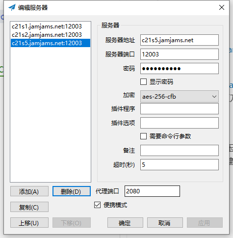

## 节点及配置
***
#### url

`ss://YWVzLTI1Ni1nY206RmZZZlJhRVZmNEBjMjFzMS5qYW1qYW1zLm5ldDoxMjAwMw==`

`ss://YWVzLTI1Ni1nY206RmZZZlJhRVZmNEBjMjFzMi5qYW1qYW1zLm5ldDoxMjAwMw==`

`ss://YWVzLTI1Ni1jZmI6RmZZZlJhRVZmNEBjMjFzNS5qYW1qYW1zLm5ldDoxMjAwMw==`

#### 服务器配置

| 节点1 | 服务器地址 | 密码 | 加密 | 端口 |
|:------|:-----|:-----|:------|:------|
| 1 | c21s1.jamjams.net | FfYfRaEVf4 | aes-256-gcm | 12003 |
| 2 | c21s2.jamjams.net | FfYfRaEVf4 | aes-256-gcm | 12003 |
| 3 | c21s5.jamjams.net | FfYfRaEVf4 | aes-256-cfb | 12003 |

## windows教程
***

#### 1. 下载地址
* 见群文件或百度云盘

> 链接：https://pan.baidu.com/s/1r5tuxQ35XVYM-BX1HvSTaw 
提取码：ogbr 
复制这段内容后打开百度网盘手机App，操作更方便哦

#### 2. 使用方法

* 下载压缩包解压后启动

* 复制节点后右键小飞机图标导入节点

#### 3. 服务器配置
- 导入节点后自动弹出以下界面，点击确定键即可

#### 4. 模式设置
* 推荐设置：系统代理 -> PAC模式

#### 5. 打开网站 [Google](https://www.google.com) 测试

***
#### 打钱！

