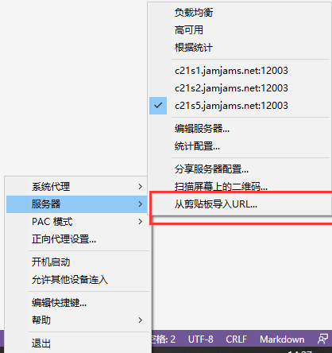
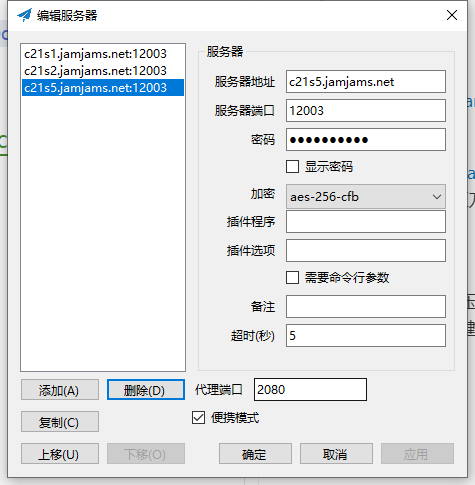
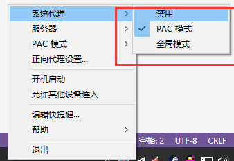

## windows教程

#### 1. 下载地址
* 见群文件或百度云盘

> 链接：https://pan.baidu.com/s/1r5tuxQ35XVYM-BX1HvSTaw 
提取码：ogbr 
复制这段内容后打开百度网盘手机App，操作更方便哦

#### 2. 使用方法

* 下载压缩包解压后启动

* 复制节点后右键小飞机图标导入节点

#### 3. 服务器配置
- 导入节点后自动弹出以下界面，点击确定键即可

#### 4. 模式设置
* 推荐设置：系统代理 -> PAC模式

#### 5. 打开网站 [Google](https://www.google.com) 测试

